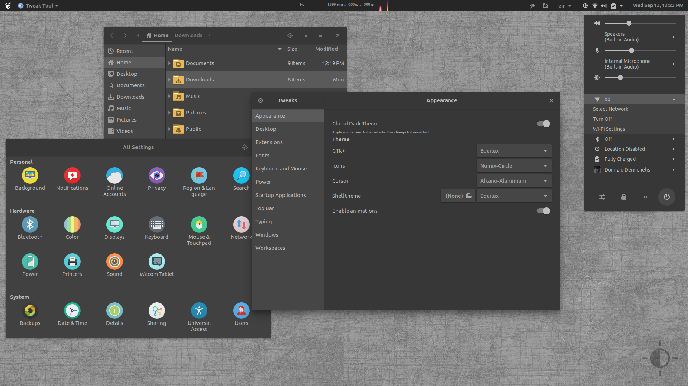

# Equilux Theme



The Equilux Theme provides a couple of full-dark, neutral-gray themes (for GTK2, GTK3, Shell, and GDM) using the Equilux palette.

It is based on the [Materia Theme](https://github.com/nana-4/materia-theme). For detailed features and documentation, please, check the [Materia Theme](https://github.com/nana-4/materia-theme) theme.

### Motivation

If you ever worked with photos and graphics, you know how - a now trendy - bluish/greenish or otherwise colored UI gets in the way of professional results.

The Equilux themes provide a neutral dark-balanced color-scheme especially useful for professional use in image editing, graphic design, 3D rendering, ...  In that fields any color cast or excessive contrast, brightness or darkness introduced by the UI would affect the overall perception of the color and brightness balance of the images.

Besides, a dark-balanced color-scheme helps to minimize the eye strain when you pass many hours in front of the screen. A neutral color-cast-free UI helps to avoid disrupting your circadian rhythms and sleep better, working nicely with software like `f.lux`, `redshift`, `NightLight`, ...

The Equilux Theme sticks to the base theme as much as possible, and is exclusively focused on the following points:

- Total removal of any color cast from the background elements (neutral base)
- Use of a neutral base for all the UI elements, with exception of a few button/boxes
- Maximum reduction of contrast/saturation and number of elements (minimalistic UI)
- Medium overall brightness/darkness of the UI

### Changes from the base theme

- The installer script installs only the Equilux variants
- The Chrome extension is not supported
- Addition of Ubuntu font family preference
- Addition of a few utility script handy to use in development/hacking
- A few minor cosmetic fixes
- Minimal changes in the color assignations in order to make the Equilux palette work OK with the theme.

## Theme Installation/Uninstallation

**Installation**: Download the latest `equilux-theme-*.tar.gz` version listed in the [Releases](https://github.com/ddnexus/equilux-theme/releases), unzip it and move the content to `/usr/share/themes`.

**Uninstallation**: Delete the installed directories: `sudo rm -rf /usr/share/themes/Equilux{,-compact}`

## GDM Theme Installation/Uninstallation

You can change the GDM theme (a.k.a. lock/login screen) by replacing the default GNOME Shell theme.  
However, if it fails, the desktop environment may not operate correctly. So please **be careful** if doing this.

#### :warning: Cautions:
- When applying this, other third-party GNOME Shell themes would look broken until you restore to the original theme.
- If GNOME Shell has been updated, it will be restored to the original theme, so you will need to do this again.

### Installation

1. Activate the Equilux Theme variant you want to install

2. Run the following commands:

  ```sh
    GTK_THEME=$(gsettings get org.gnome.desktop.interface gtk-theme | sed "s/'//g")
    sudo ln -svb /usr/share{/themes/$GTK_THEME,}/gnome-shell/gnome-shell-theme.gresource
  ```

3. Extra step needed only for the GNOME Shell v3.26

  ```sh
    GTK_THEME=$(gsettings get org.gnome.desktop.interface gtk-theme | sed "s/'//g")
    sudo ln -svb /usr/share/themes/$GTK_THEME/gnome-shell/gnome-shell.css /etc/alternatives/gdm3.css
  ```

4. Restart the GNOME Shell. (If you are running _GNOME on Xorg_, press <kbd>Alt</kbd> + <kbd>F2</kbd> then type `r`.)

**Notice**: step #2 and #3 backup the original file and create a symlink to the theme file in its place. Remove the `-b` flag if you already have the backup.

### Uninstallation

1. Restore the original theme from the backup (rename the backup gresource file and overwrite the link):

  ```sh
    sudo mv -v /usr/share/gnome-shell/gnome-shell-theme.gresource{~,}
  ```

2. Extra step needed only for the GNOME Shell v3.26 (rename the css file and overwrite the link)

  ```sh
    sudo mv -v /etc/alternatives/gdm3.css{~,}
  ```
3. Restart the GNOME Shell. (If you are running _GNOME on Xorg_, press <kbd>Alt</kbd> + <kbd>F2</kbd> then type `r`.)


### Branches

Master is always the upstream master: no changes from the base theme there.
The `equilux-*` branch(es) are the branches with the changes from the upstream master.
Please, notice that the `*-dev` branches may get rebased on top of master. The old versions will be tagged and will not be removed/rebased.

## License

The Equilux Theme is distributed under the terms of the GNU General Public License, version 2 or later. See the [`COPYING`](COPYING) file for details.

## Credits

- All credits go to the [Materia Theme](https://github.com/nana-4/materia-theme).
